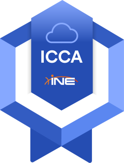

# ICCA-Notes

## ☁️ ICCA — Cloud Foundations & Management Learning Path
- Introduces foundational cloud concepts and cloud management basics
- Covers skills applicable across major cloud providers (AWS, Azure, Google Cloud)
- Prepares learners for the ICCA exam and certification

### Course Overview
- ~17 hours (may vary as INE updates the learning path)
- Activities: 2 sections, 3 courses, 33 videos, 23 quizzes, 9 labs
- Instructor: Tracy Wallace

  
|      Cloud Overview     |
| :---------------------: |
|  VIDEO DURATION: 8h 5m  |
| ACTIVITIES DURATION: 8h 20m|
|      SECTIONS: 4        |
|       COURSES: 3        |
|       VIDEOS: 35        |
|       QUIZZES: 23       |
|        LABS: 9          |

### Sections
- **Cloud Foundations**
- **Cloud Management Concepts**
- **Fundamentals of Cloud Identity, Security, and Compliance**

## ICCA Exam (Hands-on Lab)
- Time limit: **90 minutes**
- Questions: **46**
- Hands-on Lab Objectives: **4**
- Certification validity: 3 years
- Format: **Open-book**, in-browser hands-on lab
- Passing criteria (as shown in the exam platform):
  - Overall score **≥ 70%**
  - Meet **domain minimum requirements**
  - Pass at least **50% of all lab tasks**

### High-level Objectives
- Explain cloud management concepts
- Describe cloud benefits and data protection concepts/tools
- Explain regulatory compliance, infrastructure protection, and IAM concepts
- Differentiate **PaaS** vs **IaaS**
- Identify monitoring/automation features and common identity risks
